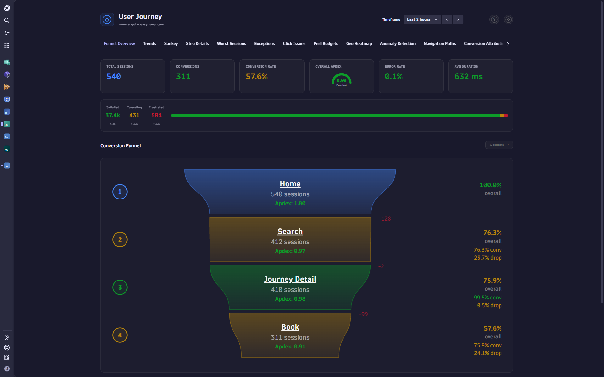

# User Journey

A 25-tab frontend observability suite built as a Dynatrace Platform App. Provides real user monitoring (RUM) funnel analysis, Web Vitals tracking, geographic heatmaps, predictive forecasting, and more — all powered by DQL.



## Features

| Tab | Description |
|-----|-------------|
| **Funnel Overview** | Conversion funnel with Apdex scoring and drop-off analysis |
| **Trends** | Period-over-period time-series for key funnel metrics |
| **Web Vitals** | LCP, CLS, INP, TTFB with good/poor thresholds |
| **Sankey** | Flow visualization with 5 rendering styles |
| **Step Details** | Per-step performance breakdowns |
| **Worst Sessions** | Sessions with worst performance or highest drop-off |
| **Exceptions** | Frontend/backend exception analysis with affected sessions |
| **Click Issues** | Rage clicks, dead clicks, and click-path problems |
| **Perf Budgets** | Performance budget compliance monitoring |
| **Geo Heatmap** | Geographic performance heatmap |
| **Map** | World and US map visualizations |
| **Navigation Paths** | User navigation path analysis |
| **Anomaly Detection** | Anomalous metric and session detection |
| **Conversion Attribution** | Factors most impacting conversion by device/browser |
| **Executive Summary** | High-level dashboard for leadership |
| **Segmentation** | User segment analysis |
| **Errors & Drop-offs** | Error correlation with funnel abandonment |
| **What-If Analysis** | Simulated scenario modeling |
| **Root Cause Correlation** | Correlate performance issues with root causes |
| **Predictive Forecasting** | Forecast future trends |
| **Resource Waterfall** | Resource-level loading waterfall per funnel step |
| **Change Intelligence** | Before/after metrics around deployments |
| **SLO Tracker** | Service level objective and error budget tracking |
| **Session Replay Spotlight** | Highest-impact session replays |
| **A/B Comparison** | Platform variant performance comparison |

## Getting Started

### Prerequisites

- Node.js ≥ 16.13
- A Dynatrace environment with RUM enabled
- `dt-app` CLI (`npx dt-app`)

### Install

```bash
npm install
```

### Development

```bash
npx dt-app dev
```

### Deploy

```bash
npx dt-app deploy
```

## Configuration

The app monitors a configurable frontend application and funnel steps. Default funnel:

1. **Home** → 2. **Search** → 3. **Journey Detail** → 4. **Book**

All tabs support user-configurable visibility and ordering (persisted per user).

## Tech Stack

- **Platform:** Dynatrace App Toolkit (dt-app)
- **UI:** React 18 + Strato Design System
- **Data:** DQL via `@dynatrace-sdk/client-query`
- **Visualizations:** D3-geo, TopoJSON, custom SVG

## License

ISC
